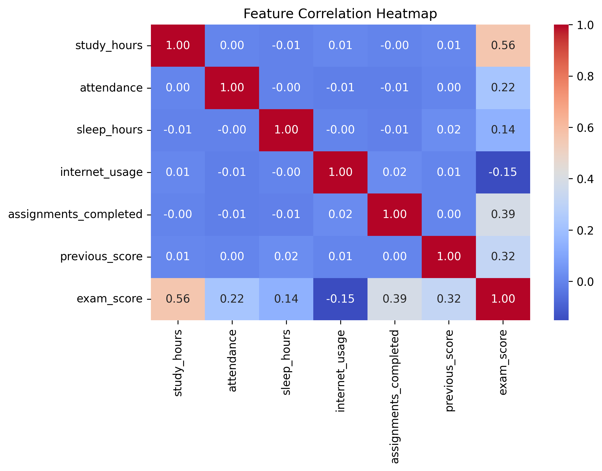
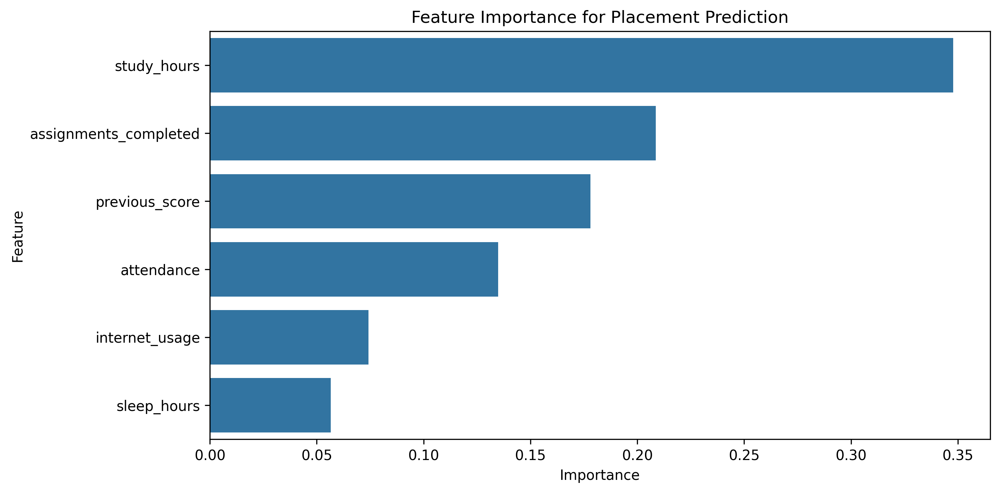
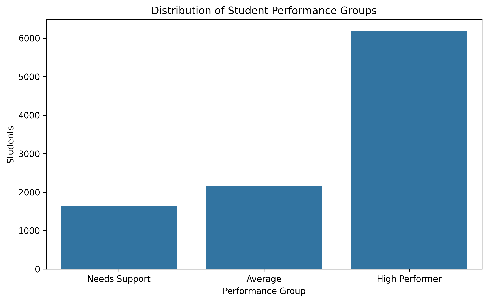
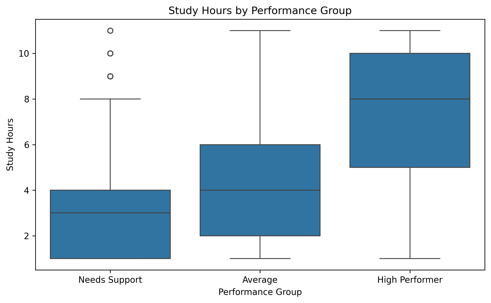

# Student Performance & Placement Prediction

An end-to-end machine learning project that analyzes student academic behavior, predicts exam performance, predicts placement outcomes, and identifies the key drivers of student success.

## Business Problem

Educational institutions often struggle to identify students who may require additional academic support before final examinations and placement evaluations.

This project aims to:

- Predict exam scores
- Predict placement outcomes
- Analyze the characteristics of successful students
- Generate actionable educational insights

## Results

### Exam Score Prediction

| Model | R² | MAE |
|---------|---------|---------|
| Linear Regression | 0.663 | 6.92 |
| Random Forest | 0.713 | 5.88 |

### Placement Prediction

| Model | Accuracy | F1 |
|---------|---------|---------|
| Logistic Regression | 90.7% | 94.5% |
| Random Forest | 89.2% | 93.7% |

## Correlation Analysis

The correlation analysis revealed that study hours, assignment completion, and previous academic performance exhibit the strongest relationships with exam scores.

## Exam Score Prediction

Study hours emerged as the most important predictor of student performance, followed by assignment completion and previous academic achievement.

## Placement Prediction

The factors influencing placement outcomes closely mirrored those affecting exam performance, highlighting the importance of academic engagement.

### Student Success Insights

## Performance Group Distribution

Students were segmented into three performance groups to better understand the characteristics associated with academic success.

## Study Habits Across Groups

High-performing students consistently reported more study hours than students requiring support.

